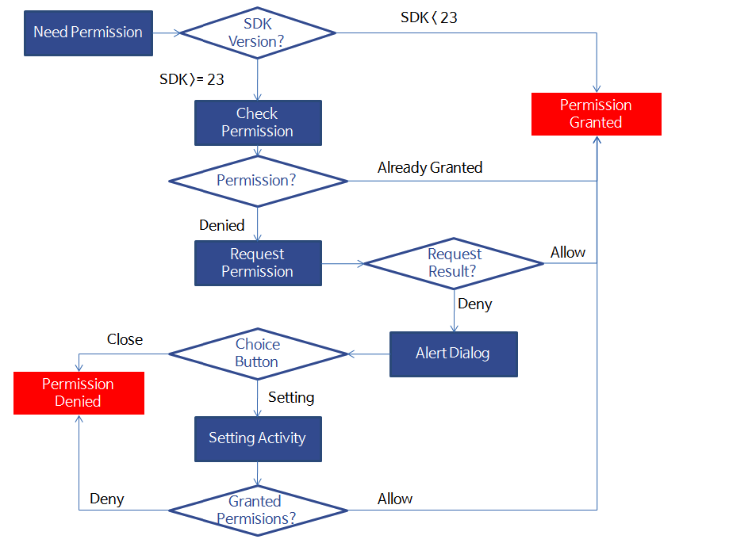

### Permify

Easily handle runtime permissions in android

## Permify (Android Runtime Permission Library)

**Permify** is a wrapper library to simplify basic system permissions logic (Easily handle runtime permissions in android).

- Very short code.
- Can check multiple permissions at once.
- Light weight (4 KB).
- Open source and fully customizable.


## Usage:

First declare your permissions in the manifest. Example:

```xml
<uses-permission android:name="android.permission.CAMERA" />
<uses-permission android:name="android.permission.READ_EXTERNAL_STORAGE" />
```

#### Single permission:

```kotlin
Permify(activity) // initialization
Permify[Permission.CAMERA] // Boolean
```

#### Multiple permissions:

```kotlin
Permify(activity) // initialization
Permify[Permission.CAMERA, Permission.READ_EXTERNAL_STORAGE, ....] // Boolean
```


----


